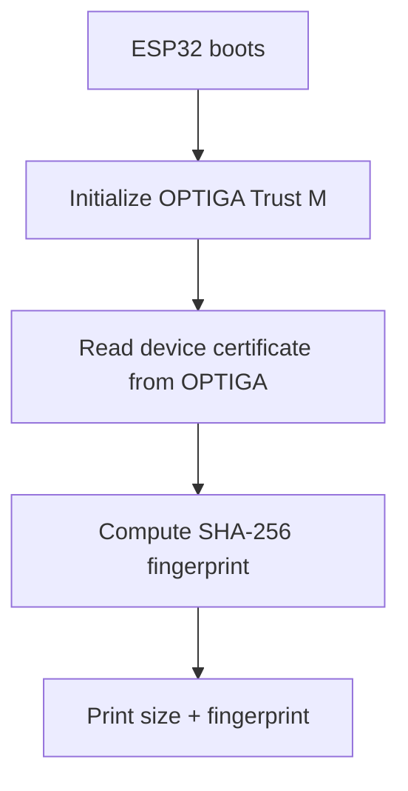

# Part 1: Device Identity with Attestation

**Prove your device is genuine - hardware-rooted identity using OPTIGA Trust M**

> **Part of 3** | [← Back to Tutorial Hub](https://github.com/nitikorn20/optiga-esp32-connectivity-tutorials)

[]()

---

## What You'll Build

A self-contained demo that:
- ✅ Runs on ESP32 with OPTIGA™ Trust M
- ✅ Shows hardware-rooted security on serial output
- ✅ Requires no cloud or external tools

---

## Quick Start (ESP-IDF)

### Prerequisites

**Hardware:**
- ESP32 DevKit (ESP32-WROOM / ESP32-DevKitC)
- OPTIGA™ Trust M Shield2Go (or Trust M breakout)

**Software:**
- ESP-IDF v5.x (tested with v5.4.1)
- Serial terminal (115200 baud, 8N1)

### Build and Flash

```bash
idf.py set-target esp32
idf.py build
idf.py -p COM7 flash
idf.py monitor
```

---

## Expected Output (Excerpt)

*Note: The demo prints only the certificate size and SHA-256 fingerprint to keep the output clean. The full PEM certificate is stored inside OPTIGA and can be extracted if needed.*

```
I (339) main_task: Started on CPU0
I (349) main_task: Calling app_main()
I (349) ATTN_MAIN: ==============================
I (349) ATTN_MAIN: OPTIGA Trust M - Attestation
I (349) ATTN_MAIN: ESP32 Demo
I (349) ATTN_MAIN: ==============================
I (359) ATTN_MAIN: Initializing OPTIGA Trust M...
I (459) pal_os_event: Init : Create Timer
I (459) pal_os_event: Init : Create Timer successful
[optiga util]     : OPTIGA Trust initialization
[optiga util]     : OPTIGA Trust initialization
I (499) pal_i2c: Initialize pal_i2c_init
I (499) pal_i2c: init successful
[optiga util]     : optiga_util_write_data successful
[optiga util]     : optiga_util_write_data successful
[optiga util]     : OPTIGA Trust initialization is successful
[optiga util]     : OPTIGA Trust initialization is successful
I (1439) ATTN_DEMO: [1] Device identity (Attestation)
I (1449) ATTN_DEMO: Certificate slot: 0xE0E0 (CONFIG_OPTIGA_TRUST_M_CERT_SLOT)
I (1459) ATTN_DEMO: Reading device certificate from OPTIGA...
I (1669) ATTN_DEMO: Factory cert size: 742 bytes
I (1669) ATTN_DEMO: Factory cert SHA-256: 9D:BB:43:39:0D:CE:8D:FF:BC:59:99:39:0E:17:A0:43:0B:01:D2:36:CA:C0:F9:E5:33:34:3A:4D:05:BC:15:90
I (1819) ATTN_DEMO: User slot metadata length: 27 bytes
I (1819) ATTN_DEMO: 20 19 c0 01 01 c4 02 06 c0 c5 02 03 89 d0 03 e1
[optiga util]     : optiga_util_write_data successful
[optiga util]     : optiga_util_write_data successful
I (2139) ATTN_DEMO: Wrote user certificate to slot 0xE0E1
I (2439) ATTN_DEMO: User cert size: 1282 bytes
I (2439) ATTN_DEMO: User cert SHA-256: FF:15:05:87:53:93:63:3C:35:88:F7:4D:A0:0B:6A:83:42:A7:30:D2:E7:52:2B:08:8C:55:FE:92:CE:59:4D:CC
I (2449) ATTN_DEMO: User cert verify: match
I (2449) ATTN_MAIN: Demo completed.
```

## Certificate Sources (Pre‑Provisioned vs User‑Provisioned)

OPTIGA Trust M can store certificates in multiple data object slots:

- **Pre‑provisioned certificate**: Factory‑installed identity certificate (unique per chip).
- **User‑provisioned certificate**: A certificate you generate and write into a writable slot.

This demo reads from the slot configured by `CONFIG_OPTIGA_TRUST_M_CERT_SLOT` and prints the **size** and **SHA‑256 fingerprint**. It also tries to read a user slot (`0xE0E1`) so you can compare factory vs user certificates.

**Tip:** If a slot is empty, the demo will report a read failure.

## Optional: Write a User‑Provisioned Certificate (Code Only)

If you prefer **not** to touch menuconfig, you can write a user certificate directly from code. Enable it by editing `main/optiga_demo_attestation.c`:

```c
#define ENABLE_USER_CERT_WRITE 1
#define USER_CERT_SLOT 0xE0E1
#define USER_CERT_PEM "-----BEGIN CERTIFICATE-----\n...\n-----END CERTIFICATE-----\n"
```

Notes:
- Use a **writable** OPTIGA data object slot.
- Writing overwrites the existing contents of that slot.
- Keep `ENABLE_USER_CERT_WRITE` at `0` for normal demos.
- When disabled, the demo skips reading the user slot to avoid buffer overflow.


You can also enable a **metadata check** (no write) to see if the user slot is readable before writing:

```c
#define ENABLE_USER_CERT_METADATA_CHECK 1
#define USER_CERT_SLOT 0xE0E1
```

## Quick User Cert Test (Edit PEM File)

You can let users replace the demo certificate by editing this file:

`main/cert/servercert.pem`

Then enable writing in code:

```c
#define ENABLE_USER_CERT_WRITE 1
#define USER_CERT_SLOT 0xE0E1
```

Rebuild + flash. The demo will write the PEM to the slot and read it back for verification.

## Config Options (Code)

You can control the demo behavior from `main/optiga_demo_attestation.c`:

- `USER_CERT_SLOT`
  - OPTIGA data object slot to store the user certificate (default `0xE0E1`).
- `ENABLE_USER_CERT_WRITE`
  - `0` = do not write user cert (default)
  - `1` = write PEM from `main/cert/servercert.pem` into `USER_CERT_SLOT`.
- `ENABLE_USER_CERT_METADATA_CHECK`
  - `1` = read metadata first; if metadata read fails, skip writing.
  - `0` = skip metadata check (not recommended).
- `USER_CERT_PEM`
  - Auto-generated from `main/cert/servercert.pem` during build (see `main/CMakeLists.txt`).
  - Leave as default; users should edit the PEM file instead.

### Example: Enable User Cert Write

```c
#define ENABLE_USER_CERT_WRITE 1
#define USER_CERT_SLOT 0xE0E1
```

**Note:** The PEM content is taken from `main/cert/servercert.pem`.

## Flow (Attestation Demo)




---

## How It Works (ESP32 + OPTIGA)

- ESP32 communicates with OPTIGA Trust M over I2C
- OPTIGA stores keys/certificates in hardware
- Sensitive operations are performed inside OPTIGA

---

## Project Notes

- This demo is intentionally minimal and self-contained
- For deeper OPTIGA features, see the Tutorial Hub resources
